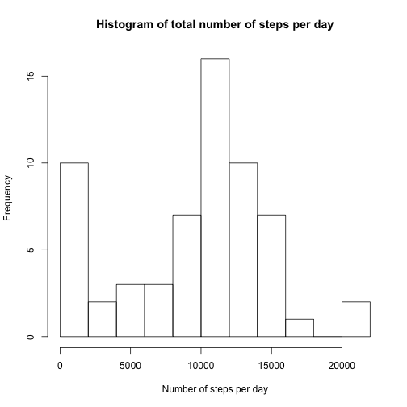
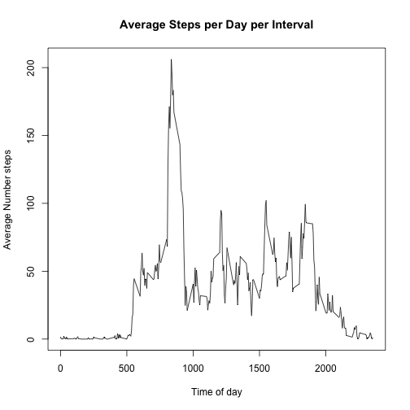
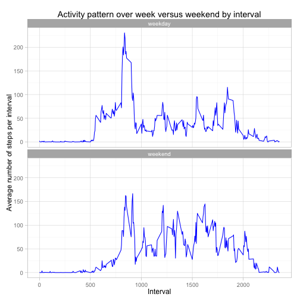

## Loading and preprocessing the data
TThis assignment makes use of data from a personal activity monitoring device. This device collects data at 5 minute intervals through out the day. The data consists of two months of data from an anonymous individual collected during the months of October and November, 2012 and include the number of steps taken in 5 minute intervals each day.

```r
library(dplyr)
#The data is read from "activity.zip" in the working directory
unzip("activity.zip")
activity <- tbl_df(read.csv("activity.csv"))

activity <- activity %>%
        mutate(new_date=as.Date(date, "%Y-%m-%d")) %>%
        mutate(new_interval=sprintf("%04d",interval)) %>%
        mutate(new_interval_time = gsub('^([0-9]{2})([0-9]+)$', 
                '\\1:\\2', new_interval)) %>%
        mutate(new_time_interval=as.POSIXct(new_interval_time, 
                tz="", format="%H:%M"))
```


## What is mean total number of steps taken per day?
The histogram below shows the frequency certain number of steps per day occur.

```r
daily_data <- activity %>%
    select(new_date, steps) %>%
    group_by(new_date) %>%
    summarise(total_steps = sum(steps, na.rm=TRUE))

hist(daily_data$total_steps, breaks=10, 
     xlab="Count of number of steps taken per day")
```

 

```r
mean_steps_per_day <- mean(daily_data$total_steps, na.rm = TRUE)
median_steps_per_day <- median(daily_data$total_steps, na.rm=TRUE)
```
The mean number of steps taken per day is 9354.2295082.
The median number of steps taken per day is 10395.

## What is the average daily activity pattern?
The graph below shows the average number of steps taken per time interval, across all the days in the data set.


```r
activity_pattern <- activity %>%
        select(interval, steps) %>%
        group_by(interval) %>%
        summarise(ave_steps_per_interval =  mean(steps, na.rm=TRUE))

plot(activity_pattern$interval, activity_pattern$ave_steps_per_interval, type="l",
     main = "Average Steps per Day per Interval",ylab = "Average Number steps", 
     xlab = "Time of day")
```

 

```r
max_interval <- max(activity_pattern$ave_steps_per_interval)
max_position <- which.max(activity_pattern$ave_steps_per_interval)
max_interval_value <- activity_pattern$interval[max_position]
```
The 5-minute interval, on average across all the days in the dataset that contains
the maximum number of steps is 835

## Imputing missing values
There are a number of days/intervals where there are missing values (coded as NA). 

```r
number_of_nas <- sum(is.na(activity$steps))
```
The total number of missing values in the dataset is 2304

Below shows the difference in the data when the missing values are filled using the mean for the 5 minute interval in question. The histogram shows the frequency certain number of steps per day occur.


```r
#TEST$UNIT[is.na(TEST$UNIT)] <- as.character(TEST$STATUS[is.na(TEST$UNIT)])
#    Devise a strategy for filling in all of the missing values in the dataset. The strategy does not need to be sophisticated. For example, you could use the mean/median for that day, or the mean for that 5-minute interval, etc.

#    Create a new dataset that is equal to the original dataset but with the missing data filled in.


activity$new_steps <- activity$steps[which(is.na(activity$steps))] <- activity_pattern$ave_steps_per_interval[activity$interval]
```

```
## Warning in activity$steps[which(is.na(activity$steps))] <-
## activity_pattern$ave_steps_per_interval[activity$interval]: number of
## items to replace is not a multiple of replacement length
```

```
## Error in `$<-.data.frame`(`*tmp*`, "new_steps", value = c(0.0754716981132075, : replacement has 17507 rows, data has 17568
```

```r
new_mean_steps_per_day <- 0
new_median_steps_per_day <-0
```

The new mean number of steps taken per day is 0.
The new median number of steps taken per day is 0.

You can see that the median differs from the estimate from the first part of the assignment.  The impact of imputing missing data on the estimates of the total daily number of steps is: 

***************

## Are there differences in activity patterns between weekdays and weekends?
We can see a difference in the activity pattern between weekdays and weekends by looking at the daily activity pattern graph from above, with weekends and weekdays graphed individually.


```r
weekly_activity <- activity %>%
        mutate(weekday = factor(ifelse(weekdays(new_date) %in% c("Saturday",
                "Sunday"), "weekend", "weekday"))) %>%
        select(interval, steps, weekday) %>%
        group_by(weekday, interval) %>%
        summarise(ave_steps_per_interval =  mean(steps, na.rm=TRUE))

library (ggplot2)

g <- ggplot(weekly_activity, aes(interval, ave_steps_per_interval)) +  
        geom_line(color="blue") + facet_wrap(~ weekday, nrow=2) +
        xlab("Interval") + 
        ylab("Average number of steps per interval") + theme_light() +
        ggtitle("Activity pattern over week versus weekend by interval")
print (g)
```

 
